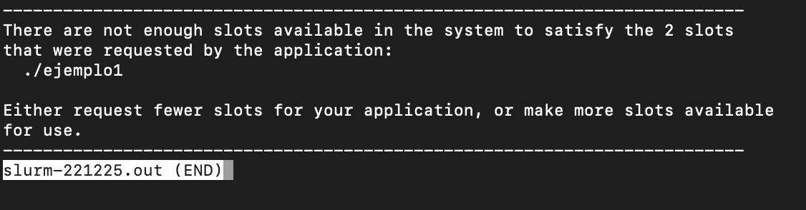

# Memoria de la practica 2:

**Autor:** [Amador Carmona Méndez]

**Asignatura:**[Arquitecturas y Computación de Altas Prestaciones]

**Fecha:** [24/05/2024]


## Ejercicio1:
### Ejecución1
```sh
sbatch -p acap -Aacap -N 1 -n 2 --wrap "mpirun -n 2 ./ejemplo1"
```
-p acap: Especifica la partición en la que se va a ejecutar el trabajo. En este caso, la partición se llama "acap".

-Aacap: Especifica la cuenta a la que se va a cargar el trabajo. En este caso, la cuenta se llama "acap".

-N 1: Solicita un nodo para la ejecución del trabajo.

-n 2: Solicita dos tareas (procesos MPI) para la ejecución del trabajo.

--wrap "mpirun -n 2 ./ejemplo1": El comando --wrap permite ejecutar un comando dentro del script de Slurm. Aquí se especifica que mpirun debe ejecutar ejemplo1 con 2 procesos MPI (-n 2).
En esta ejecución, Slurm intentará asignar un solo nodo y ejecutar 2 procesos MPI en ese nodo.

### Ejecución2
```sh
sbatch -p acap -Aacap -N 2 -n 2 --wrap "mpirun -n 2 ./ejemplo1"
```
-N 2: Solicita dos nodos para la ejecución del trabajo.

-n 2: Solicita dos tareas (procesos MPI) para la ejecución del trabajo.

--wrap "mpirun -n 2 ./ejemplo1": Especifica que mpirun debe ejecutar ejemplo1 con 2 procesos MPI (-n 2).
En esta ejecución, Slurm intentará asignar dos nodos y ejecutar 2 procesos MPI distribuidos entre esos nodos. Dado que sólo hay 2 procesos MPI y 2 nodos, cada nodo puede ejecutar un proceso, pero puede resultar en una subutilización de los recursos, ya que cada nodo tiene capacidad para ejecutar más procesos.

### Ejecución3
```sh
sbatch -p acap -Aacap -N 1 -n 1 --wrap "mpirun -n 2 ./ejemplo1"
```
-N 1: Solicita un nodo para la ejecución del trabajo.

-n 1: Solicita una tarea (proceso MPI) para la ejecución del trabajo.

--wrap "mpirun -n 2 ./ejemplo1": Especifica que mpirun debe ejecutar ejemplo1 con 2 procesos MPI (-n 2).
En esta ejecución, hay una inconsistencia porque se solicita ejecutar 2 procesos MPI (mpirun -n 2), pero sólo se ha solicitado una tarea con Slurm (-n 1). Slurm verá esta solicitud como inviable, ya que no puede cumplir con la solicitud de recursos necesarios para ejecutar 2 procesos MPI con sólo un proceso asignado. Esto resultará en un error o en un trabajo en estado "pendiente" indefinidamente hasta que los recursos solicitados sean consistentes con los requerimientos.
### Ejecuciones 




## Ejercicio2:
### Cambios realizados respecto al ejemplo4.c
1. Inclusión del Proceso Maestro en el Cálculo:

Se ha modificado el masterTask para que el proceso maestro (rank 0) también participe en el cálculo del producto escalar.
En la función masterTask, se incluye una sección donde el maestro calcula su parte del producto escalar y envía su resultado parcial a sí mismo utilizando MPI_Send.

2. Evitación del Cierre Prematuro de Trabajadores:

Se ha añadido un bucle en la función worker que permite que los procesos trabajadores sigan esperando nuevos trabajos hasta recibir una señal de terminación (DESTROY_TAG).

3. Cambio en la Distribución de Datos:

En lugar de dividir los datos solo entre los procesos trabajadores, ahora los datos se dividen entre todos los procesos, incluyendo el maestro. Esto asegura que todos los procesos participen en el cálculo del producto escalar.

### Ejecución

## Ejercicio3:
### Descripción de la solución
Para este ejercicio hemos dividido el codigo en distintas funciones segun el proceso y la funcionalidad de este, tenemos por lo tanto 4 procesos [0, 1, 2 y 3] (en el comando 4 reutilizamos el codigo del proceso 1,2 y 3):
1. Proceso 0: Coordinador y Entrada/Salida

Este proceso solicita comandos al usuario en un bucle infinito.
Dependiendo del comando ingresado, delega tareas a los otros procesos:
Si el comando es 0, el programa termina.
Si el comando es 1, pide una longitud de vector y la envía al proceso 1 para que genere un vector de números aleatorios.
Si el comando es 2, pide una palabra y la envía al proceso 2 para que calcule la suma de los valores ASCII de sus caracteres.
Si el comando es 3, pide una palabra y la envía al proceso 3 para que la convierta a mayúsculas.
Si el comando es 4, realiza todas las acciones anteriores: pide una longitud de vector y una palabra, y envía los datos a los procesos correspondientes.

2. Proceso 1: Generador de Vector Aleatorio

Este proceso recibe la longitud de un vector del proceso 0.
Genera un vector de números aleatorios entre 0 y 1 con la longitud especificada y lo muestra en pantalla.

3. Proceso 2: Calculador de Suma ASCII

Recibe una palabra del proceso 0.
Calcula la suma de los valores ASCII de cada carácter en la palabra y muestra el resultado.

4. Proceso 3: Convertidor a Mayúsculas

Recibe una palabra del proceso 0.
Convierte todos los caracteres de la palabra a mayúsculas y muestra la palabra convertida.
### Ejecución


## Ejercicio 4
### Descripción de la solución
Estructura del Código
1. Inicialización y Configuración de MPI

El programa comienza inicializando MPI y obteniendo el número de procesos y el rango de cada proceso:
```c
MPI_Init(&argc, &argv);
MPI_Comm_rank(MPI_COMM_WORLD, &rank);
MPI_Comm_size(MPI_COMM_WORLD, &numProcs);
```
2. Configuración de Parámetros
```c
#define N 1000000000  // Número de rectángulos para la aproximación
#define BASE 1.0      // Base de cada rectángulo
#define TAG_RESULT 1  // Etiqueta para enviar resultados parciales

double delta_x = BASE / N;
double start_time, end_time;
```
3. Medición del Tiempo de Inicio

Solo el proceso 0 (coordinador) mide el tiempo de inicio:

```c
if (rank == 0) {
    start_time = MPI_Wtime();
}
```
4. Cálculo de la Suma Parcial por Cada Proceso

Cada proceso calcula su parte de la suma. El índice de inicio y los saltos están determinados por el rango del proceso (rank) y el número total de procesos (numProcs):

```c
for (i = rank; i < N; i += numProcs) {
    x = (i + 0.5) * delta_x;
    sum += f(x);
}
```
5. Comunicación de Resultados Parciales

Cada proceso, excepto el proceso 0, envía su suma parcial al proceso 0. El proceso 0 recibe estas sumas parciales y las acumula:

```c
if (rank != 0) {
    MPI_Send(&sum, 1, MPI_DOUBLE, 0, TAG_RESULT, MPI_COMM_WORLD);
} else {
    double partialSum;
    for (i = 1; i < numProcs; i++) {
        MPI_Recv(&partialSum, 1, MPI_DOUBLE, i, TAG_RESULT, MPI_COMM_WORLD, MPI_STATUS_IGNORE);
        sum += partialSum;
    }
    pi = sum * delta_x;
}
```
6. Medición del Tiempo Final y Salida de Resultados

El proceso 0 mide el tiempo de finalización y calcula el valor de π. Luego, imprime la aproximación de π el tiempo empleado:

```c
if (rank == 0) {
    end_time = MPI_Wtime();
    printf("Aproximación de Pi: %.15f\n", pi);
    printf("Tiempo empleado: %.6f segundos\n", end_time - start_time);
}
```
7. Finalización de MPI

Finalmente, todos los procesos finalizan MPI:

```c
MPI_Finalize();
```
### Ejecución


## Prompt de las ejecuciones:
```sh
[acap3@atcgrid practica1]$ mpicc ejercicio2.c -o ejercicio2
[acap3@atcgrid practica1]$ mpicc ejercicio3.c -o ejercicio3
ejercicio3.c: In function ‘proceso0’:
ejercicio3.c:27:24: warning: ‘return’ with a value, in function returning void
   27 |                 return 0;
      |                        ^
ejercicio3.c:13:6: note: declared here
   13 | void proceso0(int rank, int numProcs) {
      |      ^~~~~~~~
[acap3@atcgrid practica1]$ mpicc ejercicio4.c -o ejercicio4
[acap3@atcgrid practica1]$ mpirun ejercicio2 10000
El producto escalar de los vectores U y V es: 846739120
[acap3@atcgrid practica1]$ mpirun ejercicio4
Aproximación de Pi: 3.141592653589768
Tiempo empleado: 1.451159 segundos
[acap3@atcgrid practica1]$ mpirun ejercicio4
Aproximación de Pi: 3.141592653589768
Tiempo empleado: 1.645073 segundos
[acap3@atcgrid practica1]$ mpirun ejercicio4
Aproximación de Pi: 3.141592653589768
Tiempo empleado: 1.492728 segundos
[acap3@atcgrid practica1]$ mpirun ejercicio3

Ingrese el comando (0 para salir, 1 para vector aleatorio, 2 para suma de ASCII, 3 para convertir a mayúsculas, 4 para todas las acciones): 1
Ingrese la longitud del vector: 10

Ingrese el comando (0 para salir, 1 para vector aleatorio, 2 para suma de ASCII, 3 para convertir a mayúsculas, 4 para todas las acciones): 0.84 0.39 0.78 0.80 0.91 0.20 0.34 0.77 0.28 0.55 
2
Ingrese una palabra: Hola

Ingrese el comando (0 para salir, 1 para vector aleatorio, 2 para suma de ASCII, 3 para convertir a mayúsculas, 4 para todas las acciones): Suma de valores ASCII: 388
3
Ingrese una palabra: hola me llamo amador

Ingrese el comando (0 para salir, 1 para vector aleatorio, 2 para suma de ASCII, 3 para convertir a mayúsculas, 4 para todas las acciones): Ingrese una palabra: 
Ingrese el comando (0 para salir, 1 para vector aleatorio, 2 para suma de ASCII, 3 para convertir a mayúsculas, 4 para todas las acciones): Ingrese una palabra: 
Ingrese el comando (0 para salir, 1 para vector aleatorio, 2 para suma de ASCII, 3 para convertir a mayúsculas, 4 para todas las acciones): Ingrese una palabra: 
Ingrese el comando (0 para salir, 1 para vector aleatorio, 2 para suma de ASCII, 3 para convertir a mayúsculas, 4 para todas las acciones): Palabra en mayúsculas: HOLA
Palabra en mayúsculas: ME
Palabra en mayúsculas: LLAMO
Palabra en mayúsculas: AMADOR
3
Ingrese una palabra: esternocleidomastoideo
Palabra en mayúsculas: ESTERNOCLEIDOMASTOIDEO

Ingrese el comando (0 para salir, 1 para vector aleatorio, 2 para suma de ASCII, 3 para convertir a mayúsculas, 4 para todas las acciones): 4
Ingrese la longitud del vector: 5
0.48 0.63 0.36 0.51 0.95 
Ingrese una palabra: amador

Ingrese el comando (0 para salir, 1 para vector aleatorio, 2 para suma de ASCII, 3 para convertir a mayúsculas, 4 para todas las acciones): Suma de valores ASCII: 1016
Palabra en mayúsculas: AMADOR
0
[acap3@atcgrid practica1]$
```
