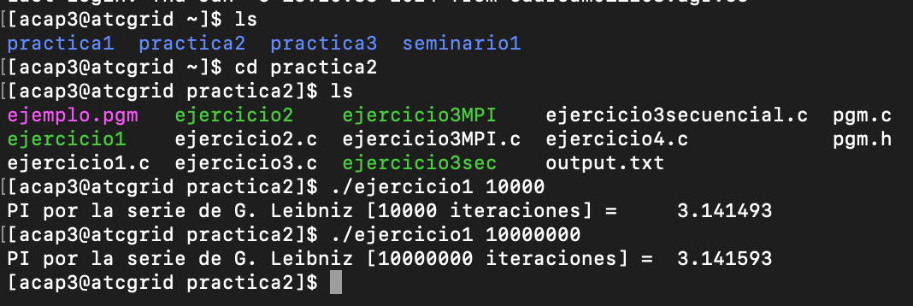
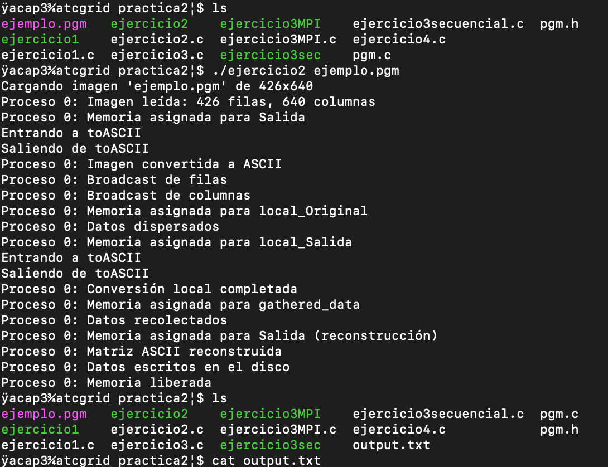
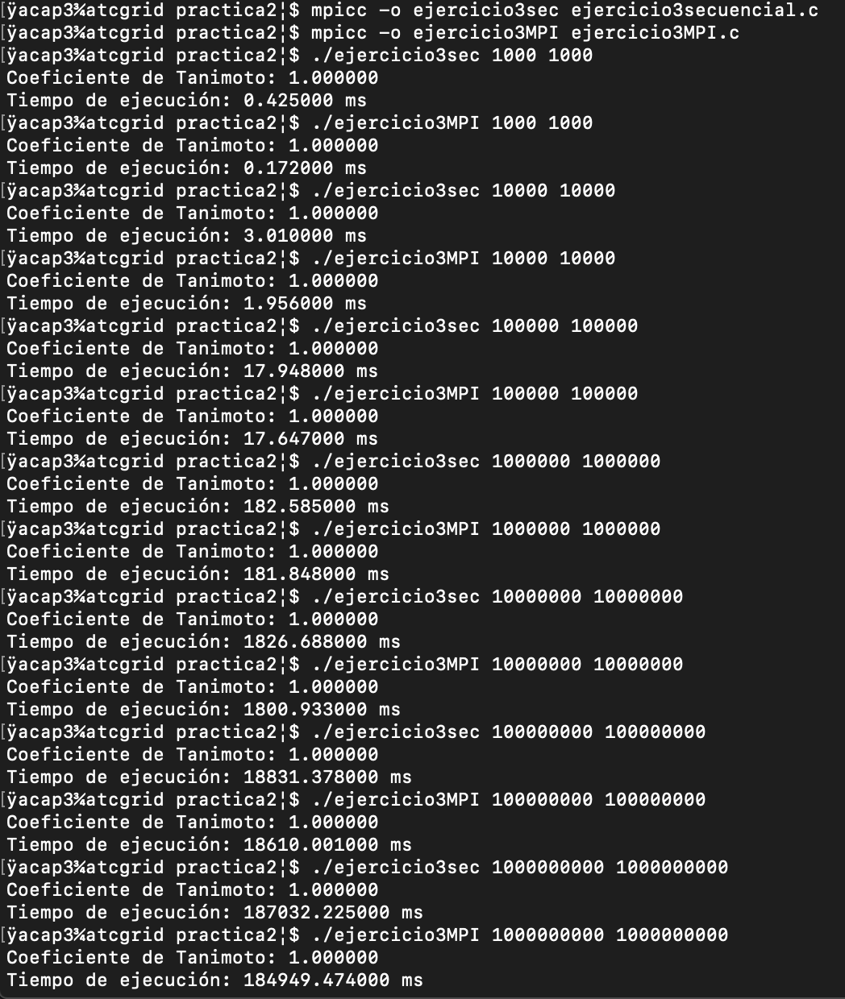

# Memoria de la practica 2:

**Autor:** [Amador Carmona Méndez]

**Asignatura:**[Arquitecturas y Computación de Altas Prestaciones]

**Fecha:** [24/05/2024]

## Ejercicio 1:

### Descripción de la solución
La versión paralelizada con MPI que he llevado a cabo (ejercicio1.c) introduce varios cambios respecto a la versión secuencial  dada por el profersor (pi_Leibniz.c):

1. División de la carga:

En la función piLeibniz, se calcula start y end para determinar el rango de iteraciones que cada proceso debe ejecutar. Esto asegura que la carga se divida entre los procesos.
El último proceso maneja cualquier iteración adicional para equilibrar la carga (if (rank == size - 1) { end = steps; }).

2. Cálculo paralelo:

Cada proceso calcula su parte de la suma en la serie de Leibniz (partpi) utilizando el rango de iteraciones que le corresponde (for (int i = start; i < end; i++)).

3. Reducción y recolección de resultados:

MPI_Reduce(&pi, &total_pi, 1, MPI_DOUBLE, MPI_SUM, 0, MPI_COMM_WORLD); se utiliza para sumar las contribuciones de todos los procesos y almacenar el resultado en el proceso 0.

#### Opinión respecto a la versión secuencial
La versión paralelizada con MPI ofrece varias ventajas respecto a la versión secuencial:

Rendimiento: La paralelización permite que el cálculo de π utilizando la serie de Leibniz se distribuya entre múltiples procesadores. Esto puede reducir significativamente el tiempo de ejecución, especialmente para un número grande de iteraciones.

Escalabilidad: La implementación MPI puede escalar a múltiples nodos en un clúster, aprovechando los recursos de cómputo disponibles.

Eficiencia: El uso de MPI_Reduce para combinar los resultados parciales de cada proceso asegura que la recolección de resultados sea eficiente y evita la sobrecarga de comunicación.

Sin embargo, hay que tener en cuenta que puede ocurrir sobrecarga por el uso de MPI, es decir,  para un número muy pequeño de iteraciones, la sobrecarga de inicializar y finalizar MPI puede ser mayor que el beneficio obtenido por la paralelización.

### Ejecución

## Ejercicio 2:

### Descripción de la solución
La solución llevada a cabo consiste en paralelizar la conversión de una imagen en formato PGM a una representación ASCII utilizando MPI. El proceso 0 es responsable de leer la imagen PGM, distribuir la información de la imagen a los demás procesos, y finalmente recolectar y escribir el resultado en disco. Primero, el proceso 0 lee la imagen y almacena sus dimensiones (rows y cols). Luego, la matriz original de la imagen se reparte equitativamente entre los procesos usando MPI_Scatter. Cada proceso convierte su parte de la imagen a ASCII mediante la función toASCII. Una vez completada la conversión local, los resultados se recolectan en el proceso 0 usando MPI_Gather, donde se reconstruye la matriz completa en ASCII y se guarda en un archivo de salida.

### Opinión sobre el uso de GetMem2D y nivel de paralelismo
La función GetMem2D facilita la gestión de la memoria para las matrices bidimensionales, proporcionando una forma estructurada de asignar y liberar memoria. Esto es útil en el contexto de MPI, ya que cada proceso necesita asignar y gestionar su propia parte de la imagen y el resultado ASCII. Utilizar GetMem2D mejora la claridad del código y reduce el riesgo de errores relacionados con la memoria.

En cuanto al nivel de paralelismo, este problema es altamente paralelizable porque la conversión de cada píxel es independiente de los demás. De acuerdo con la Ley de Amdahl, el tiempo total de ejecución de un programa paralelo está limitado por la porción secuencial del programa. En este caso, la parte secuencial (lectura de la imagen y escritura del resultado) es mínima en comparación con la parte paralela (conversión de píxeles), lo que permite un alto grado de aceleración y eficiencia al utilizar múltiples procesadores. Por lo tanto, el problema tiene un buen nivel de paralelismo y es apto para beneficiarse significativamente de la paralelización con MPI.

### Ejecución

## Ejercicio 3:

### Descripción de la solución

La solución consiste en implementar el cálculo del coeficiente de Tanimoto tanto en una versión secuencial como en una versión paralelizada utilizando MPI. En la versión secuencial, el programa inicializa dos conjuntos de números enteros aleatorios y calcula el coeficiente de Tanimoto al medir la intersección y la unión de los dos conjuntos. La versión paralela distribuye los cálculos entre varios procesos MPI: el proceso 0 inicializa los conjuntos, reparte las porciones de los conjuntos a los demás procesos utilizando MPI_Scatter, y cada proceso calcula su parte del coeficiente de Tanimoto localmente. Los resultados locales se reducen a un único valor en el proceso 0 utilizando MPI_Reduce.
### Aceleración
La aceleración se calcula como el cociente entre el tiempo de ejecución secuencial y el tiempo de ejecución paralelo.
#### Tabla con los datos:
| Tamaño de entrada | Tiempo Secuencial (ms) | Tiempo MPI (ms) | Speedup |
|-------------------|-------------------------|-----------------|---------|
| 1000              | 0.425                   | 0.172           | 2.47    |
| 10000             | 3.01                    | 1.956           | 1.54    |
| 100000            | 17.948                  | 17.647          | 1.02    |
| 1000000           | 182.585                 | 181.848         | 1.00    |
| 10000000          | 1826.688                | 1800.933        | 1.01    |
| 100000000         | 18831.378               | 18610.001       | 1.01    |
| 1000000000        | 187032.225              | 184949.474      | 1.01    |

#### Gráfica de la aceleración

Los resultados muestran que la aceleración es significativa para tamaños de entrada pequeños, pero se estabiliza cerca de 1 para tamaños de entrada más grandes. Esto sugiere que la sobrecarga de comunicación y sincronización entre los procesos MPI puede volverse significativa en comparación con el tiempo de cómputo para tamaños de entrada grandes, limitando la aceleración obtenida. Lo cual no tiene mucho sentido ya que deberia ser a cuanto mayor tamaño del problema mayor aceleracion del programa prarlelo respecto al secuencial ya que divide el problema y trabaja paralelamente, no se si por la manera de implementerlo, o a la hora de ejecutarlo algo he realizado mal con la comunicación de MPI que nos da estos valores.

### Ejecución

