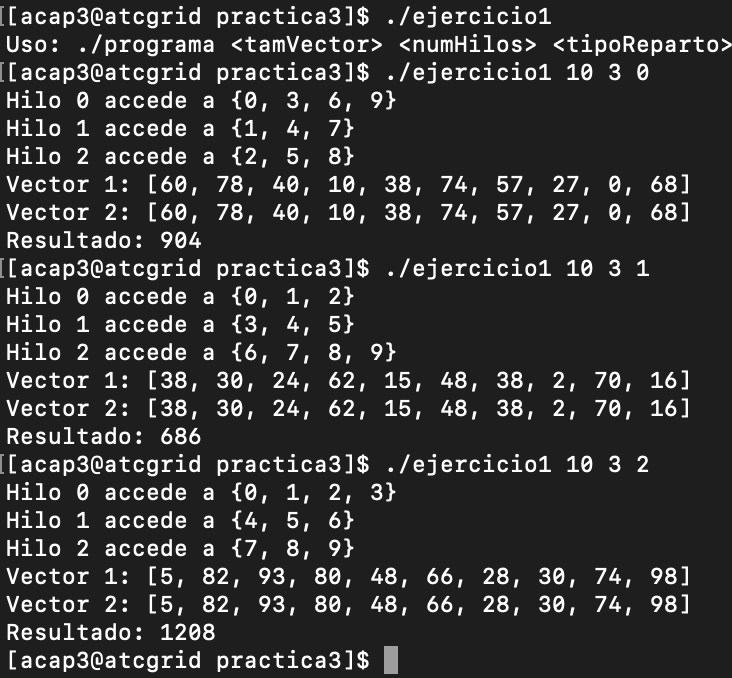
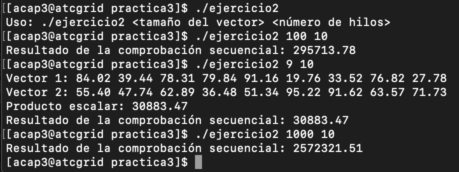
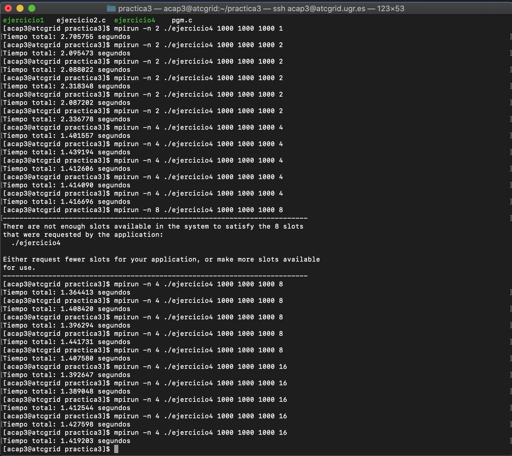
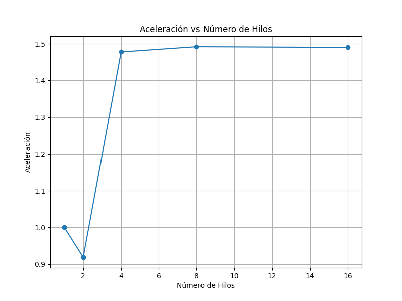
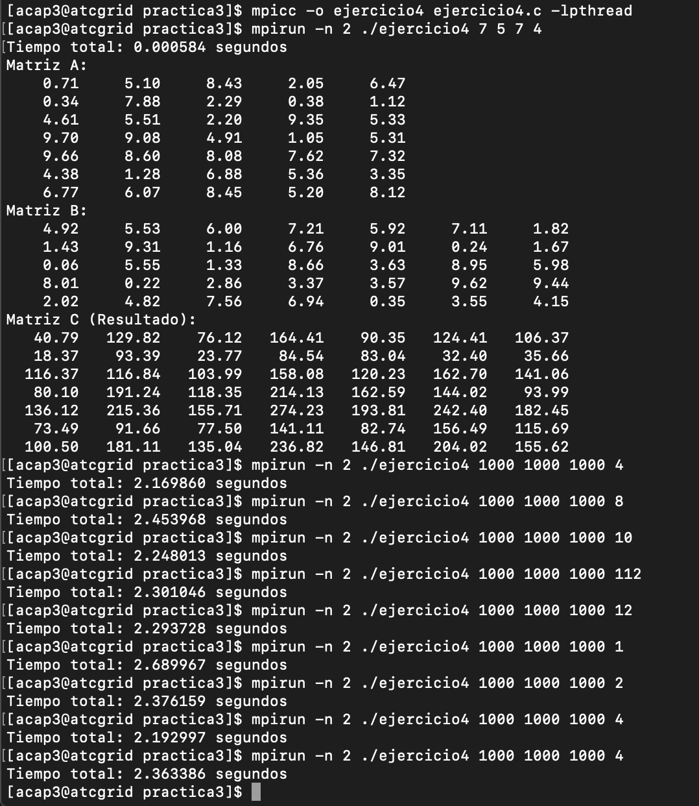

# Practica 3: 
**Autor:** [Amador Carmona Méndez]

**Asignatura:**[Arquitectura y Computación de Altas Prestaciones]

**Fecha:** [25/05/2024]
## Ejercicio 1:
El programa acepta tres argumentos: el tamaño del vector, el número de hilos a crear, y el tipo de reparto de carga entre los hilos (cíclico, por bloques, o bloques balanceados). Basándose en estos parámetros, se crean y se inicializan dos vectores con valores aleatorios y un tercer vector para almacenar el resultado. Dependiendo del tipo de reparto, cada hilo calcula la suma de una porción específica de los vectores. La sincronización entre hilos se maneja mediante mutexes para evitar condiciones de carrera al actualizar el resultado global. Finalmente, si el tamaño del vector es menor o igual a 10, se muestran los vectores originales y el resultado de la suma en la consola.
~~~ C
void* cuerpoHilo(void* arg) {
    tarea misDeberes = *((tarea*)arg);
    int inicio, fin;
    int sumaLocal = 0;

    if (misDeberes.tipoReparto == 0) { // Ciclico
        printf("Hilo %d accede a {", misDeberes.idHilo);
        for (int i = misDeberes.idHilo; i < misDeberes.tamVector; i += misDeberes.numHilos) {
            sumaLocal += misDeberes.vector1[i] + misDeberes.vector2[i];
            printf("%d", i);
            if (i + misDeberes.numHilos < misDeberes.tamVector)
                printf(", ");
        }
        printf("}\n");
    } else if (misDeberes.tipoReparto == 1) { // Por Bloques
        printf("Hilo %d accede a {", misDeberes.idHilo);
        int bloqueSize = misDeberes.tamVector / misDeberes.numHilos;
        int excedente = misDeberes.tamVector % misDeberes.numHilos;
        // Cálculo del inicio y fin del bloque para este hilo
        inicio = misDeberes.idHilo * bloqueSize;
        fin = inicio + bloqueSize;
        if(misDeberes.idHilo==misDeberes.ultimo-1){
            fin=fin+excedente;
            //printf("Hilo %d con excedente %d\n", misDeberes.idHilo,excedente);
        }
        for (int i = inicio; i < fin; i++) {
            sumaLocal += misDeberes.vector1[i] + misDeberes.vector2[i];
            printf("%d", i);
            if (i != fin - 1)
                printf(", ");
        }
        printf("}\n");
    } else if (misDeberes.tipoReparto == 2) { // Bloques balanceados
        printf("Hilo %d accede a {", misDeberes.idHilo);
        int bloqueSize = misDeberes.tamVector / misDeberes.numHilos;
        int excedente = misDeberes.tamVector % misDeberes.numHilos;
        // Cálculo del inicio y fin del bloque para este hilo
        inicio = misDeberes.idHilo * bloqueSize + MIN(misDeberes.idHilo, excedente);
        fin = inicio + bloqueSize + (misDeberes.idHilo < excedente ? 1 : 0);
        for (int i = inicio; i < fin; i++) {
            sumaLocal += misDeberes.vector1[i] + misDeberes.vector2[i];
            printf("%d", i);
            if (i != fin - 1)
                printf(", ");
            }
        printf("}\n");
    }

    pthread_mutex_lock(misDeberes.mutex);
    *(misDeberes.resultado) += sumaLocal;
    pthread_mutex_unlock(misDeberes.mutex);

    return NULL;
}
~~~

### Ejecución:

## Ejericicio2:
Sin exclusión mutua:
~~~ C
void *dot_product(void *args) {
    ThreadArgs *thread_args = (ThreadArgs *)args;
    int chunk_size = thread_args->vector_size / thread_args->num_threads;
    int start = thread_args->thread_id * chunk_size;
    int end = start + chunk_size;
    
    // Asegurarse de que el último hilo tome los elementos restantes si el tamaño no es divisible por el número de hilos
    if (thread_args->thread_id == thread_args->num_threads - 1) {
        end = thread_args->vector_size;
    }

    double local_result = 0.0;
    for (int i = start; i < end; ++i) {
        local_result += thread_args->vector1[i] * thread_args->vector2[i];
    }

    // Almacenar el resultado local en el arreglo de resultados
    thread_args->result[thread_args->thread_id] = local_result;

    pthread_exit(NULL);
}
~~~
Con exclusión mutua:
~~~ C
void *dot_product(void *args) {
    ThreadArgs *thread_args = (ThreadArgs *)args;
    int chunk_size = thread_args->vector_size / thread_args->num_threads;
    int start = thread_args->thread_id * chunk_size;
    int end = start + chunk_size;
    
    // Asegurarse de que el último hilo tome los elementos restantes si el tamaño no es divisible por el número de hilos
    if (thread_args->thread_id == thread_args->num_threads - 1) {
        end = thread_args->vector_size;
    }

    double local_result = 0.0;
    for (int i = start; i < end; ++i) {
        local_result += thread_args->vector1[i] * thread_args->vector2[i];
    }

    // Bloquear antes de actualizar el resultado compartido
    pthread_mutex_lock(thread_args->mutex);
    thread_args->result[thread_args->thread_id] = local_result;
    pthread_mutex_unlock(thread_args->mutex);

    pthread_exit(NULL);
}
~~~

### Ejecución:

## Ejercicio3:
### Parte 1:
Suponiendo el programa que funciona mal con esta funcion hebrada:
~~~ C
void* funcionHebrada(void* arg){
    tareahilo* task=(tarea_hilo*)arg;
    for(i=task->ini;i<task->end; i++){
        pthread_mutex_lock(&mutex);
        resultadoGlobal += pow(vector[i],5);
        pthread_mutex_unlock(&mutex);
    }
    returns 0;
}
~~~
### Problemas:
- Acceso concurrente no seguro a la variable resultadoGlobal: Varias hebras están intentando modificar la misma variable global resultadoGlobal simultáneamente sin ningún mecanismo de sincronización adecuado, lo que puede provocar condiciones de carrera y resultados incorrectos.
- Bloqueo del mutex dentro del bucle de iteración: El bloqueo del mutex se realiza dentro del bucle de iteración, lo que significa que cada hebra bloquea y desbloquea el mutex varias veces durante la ejecución del bucle, lo cual es innecesario y puede causar un rendimiento deficiente.
### Solucion:
~~~ C
void* funcionHebrada(void* arg){
    tarea_hilo* task = (tarea_hilo*)arg;
    double localSum = 0; // Suma local para cada hebra

    // Cálculo de la suma local
    for(int i = task->ini; i < task->end; i++) {
        localSum += pow(task->vector[i], 5);
    }

    // Bloqueo del mutex para actualizar el resultado global
    pthread_mutex_lock(&mutex);
    resultadoGlobal += localSum;
    pthread_mutex_unlock(&mutex);

    // Devolución de NULL ya que la función es de tipo void*
    return NULL;
}
~~~

### Parte 2:
Partiendo del ejercicio para convertir pgm to ASCII de la practica dos, realizamos los siguientes cambios para este ejercicio:
1. Parámetro de Submuestreo:

El tamaño de la ventana de submuestreo se pasa como un argumento al programa.
Se valida que el tamaño de la ventana esté entre 1 y 3.

2. Conversión a ASCII con Submuestreo:

La función toASCII ha sido modificada para considerar una ventana de tamaño variable y calcular el valor promedio de los píxeles dentro de esta ventana.

3. Distribución y Recolección de Datos:

Los datos se distribuyen y recolectan considerando el tamaño de la ventana para asegurar que el submuestreo se realice correctamente en paralelo.

4. Reconstrucción de la Imagen ASCII:

Después de recolectar los datos en el proceso principal, se reconstruye la imagen ASCII considerando el submuestreo.

### Ejecución:

Para ver la ejecución, es necesario abrir el archivo terminal.txt ya que por imagen no se podia apreciar la diferencia entre ejecutar con los diferentes factores. A lo mejor es necesario hacer zoom inverso ya que la imagen del paisage que he utilizado es bastante grande y a pesar de ejecutar el programa con factor 3 sigue quedando bastante grande.

[Terminal]: teminal.txt

## Ejercicio4:
### Descripción de la solución
La solución implementa un programa híbrido MPI-PThreads para calcular el producto de dos matrices de tamaño arbitrario en paralelo. El proceso 0 (el proceso principal) recibe el tamaño de las matrices y el número de hilos a utilizar por cada proceso. Luego, inicializa las matrices con valores aleatorios y comienza a medir el tiempo de la operación. A continuación, distribuye las filas de la matriz A entre todos los procesos disponibles, asegurando un reparto equilibrado, y transmite la matriz B a todos los procesos. Cada proceso recibe su parte correspondiente de la matriz A y utiliza múltiples hilos para calcular su porción del producto matricial.

Dentro de cada proceso, los hilos calculan la multiplicación de su subconjunto de filas de la matriz A con la matriz B y almacenan los resultados en una matriz local. Una vez que todos los hilos han terminado su tarea, los resultados parciales de cada proceso son enviados de vuelta al proceso 0. Este proceso reúne todas las porciones y compone la matriz resultante final. Si las matrices son pequeñas (hasta 7x7), el programa muestra las matrices originales y el resultado en la consola. Finalmente, el proceso 0 imprime el tiempo total que tomó la operación desde el inicio de la distribución de datos hasta la obtención del resultado final.

### Aceleración:
Ejecuto 5 veces por cada cantidad de hebras  y luego calculo su promedio, tras esto calculo la aceleracion. La primera ejecución la hago con una hebra para poder tomarla como tiempo secuencial para calcular la aceleracion respecto a ese tiempo.

Tenemos que los promedios son:
| Hilos | Tiempo Promedio (segundos) |
|-------|-----------------------------|
| 1     | 2.09657                     |
| 2     | 2.27736                     |
| 4     | 1.41643                     |
| 8     | 1.40330                     |
| 16    | 1.40621                     |

Por lo tanto tenemos la siguiente tabla calculando las aceleraciones:
| Hilos | Aceleración |
|-------|-------------|
| 1     | 1.00000     |
| 2     | 0.91859     |
| 4     | 1.47764     |
| 8     | 1.49187     |
| 16    | 1.48992     |

Representamos los datos en una gráfica:

### Ejecución:

