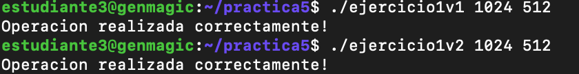
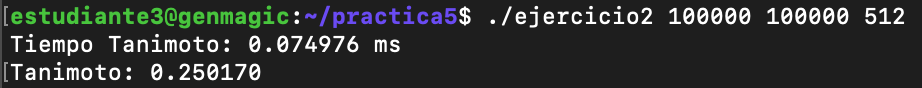
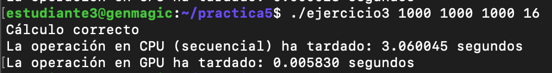
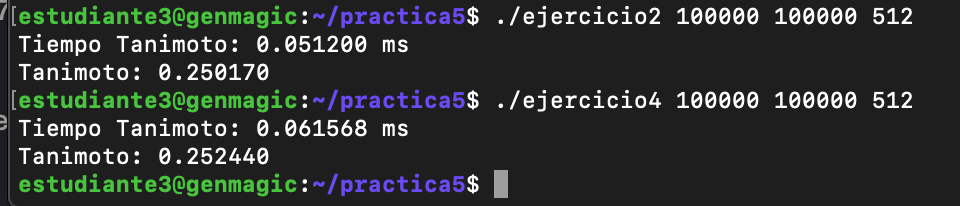
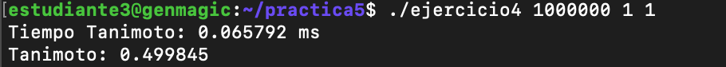

# Memoria de la practica 5:

**Autor:** Amador Carmona Méndez

**Asignatura:** Arquitecturas y Computación de Altas Prestaciones

**Fecha:** 24/05/2024

## Ejercicio 1

### Primera versión:

### Descripción

En esta primera versión del ejercicio 1, se desarrolló un programa en CUDA C para multiplicar dos vectores de tipo `float` elemento a elemento. Se utilizó un valor dinámico para el tamaño del grid, calculado en base al tamaño del vector y al tamaño del bloque. La operación se realizó en la GPU mediante un kernel específico.

#### Funcionamiento del programa

1. Se define un kernel `vectorMultiply` que calcula la multiplicación elemento a elemento de los vectores de entrada y almacena el resultado en un tercer vector. Cada hilo se encarga de un elemento de los vectores.

2. Se implementa una función `vectorMultiplyCPU` que realiza la misma operación de multiplicación en la CPU para comparar los resultados con la versión en GPU.

3. Se inicializan aleatoriamente los vectores de entrada `h_a` y `h_b` con valores en el rango de [0, 60).

4. Se calcula el tamaño del grid (`grid_size`) en función del tamaño del vector y del tamaño del bloque.

5. Se ejecuta el kernel en la GPU con la configuración de grid y bloque calculada.

6. Se copian los resultados de vuelta a la memoria del host.

7. Si el tamaño del vector es menor que 7, se ejecuta la versión CPU del cálculo y se imprimen los vectores y los resultados tanto para la CPU como para la GPU.

8. Si el tamaño del vector es mayor o igual a 7, se imprime un mensaje indicando que la operación se realizó correctamente.

9. Se liberan los recursos de memoria.

---

### Segunda versión:

#### Descripción

En esta segunda versión del ejercicio 1, se desarrolló un programa en CUDA C para multiplicar dos vectores de tipo `float` elemento a elemento. En esta ocasión, se utilizó un valor fijo para el tamaño del grid, establecido en 1024, mientras que el tamaño del bloque sigue siendo un parámetro variable.

#### Funcionamiento del programa

1. Se define un kernel `vectorMultiply` que calcula la multiplicación elemento a elemento de los vectores de entrada y almacena el resultado en un tercer vector. Cada hilo se encarga de un elemento de los vectores.

2. Se implementa una función `vectorMultiplyCPU` que realiza la misma operación de multiplicación en la CPU para comparar los resultados con la versión en GPU.

3. Se inicializan aleatoriamente los vectores de entrada `h_a` y `h_b` con valores en el rango de [0, 60).

4. Se calcula el tamaño del grid en base al valor fijo establecido (`fixed_grid_size`) y al tamaño del bloque.

5. Se ejecuta el kernel en la GPU con la configuración de grid y bloque calculada.

6. Se copian los resultados de vuelta a la memoria del host.

7. Si el tamaño del vector es menor que 7, se ejecuta la versión CPU del cálculo y se imprimen los vectores y los resultados tanto para la CPU como para la GPU.

8. Si el tamaño del vector es mayor o igual a 7, se imprime un mensaje indicando que la operación se realizó correctamente.

9. Se liberan los recursos de memoria.

### Ejecuciónes de ambas versiones




---

## Ejercicio 2

### Explicación de la solución:

En este ejercicio se implementa el cálculo del coeficiente de Tanimoto utilizando CUDA C. El kernel `intersectionKernel` se encarga de calcular la intersección de dos conjuntos dados representados por vectores de enteros en la GPU. La función `calculateTanimoto` se encarga de coordinar el cálculo en la GPU y en la CPU. 

1. Se define un kernel `intersectionKernel` que calcula la intersección de dos vectores de entrada `a` y `b`, representados por valores binarios (0 o 1), y almacena el resultado en un puntero `inter` utilizando operaciones atómicas.

2. Se implementa una función `calculateTanimoto` que coordina el cálculo del coeficiente de Tanimoto en la GPU y la CPU. Se reservan los recursos de memoria necesarios en la GPU, se copian los datos de entrada a la memoria del dispositivo, se lanza el kernel para calcular la intersección y se calcula el coeficiente de Tanimoto. 

3. En la función `main`, se inicializan aleatoriamente dos vectores de tamaño `size` con valores binarios (0 o 1) utilizando una semilla específica. Luego, se llama a la función `calculateTanimoto` para calcular el coeficiente de Tanimoto.


### Ejecución:



---

## Ejercicio 3

### Explicación de la solución:
En este ejercicio se lleva a cabo la multiplicación de matrices utilizando CUDA C. La multiplicación de matrices se realiza tanto en la CPU como en la GPU para comparar los tiempos de ejecución.

#### Implementación en CPU:

Se define una función `matrixMultiplyCPU` que multiplica dos matrices `A` y `B` y almacena el resultado en la matriz `C`. Esta función utiliza tres bucles anidados para realizar la multiplicación de matrices de forma secuencial.

#### Implementación en GPU:

Se define un kernel `matrixMultiplyGPU` que realiza la multiplicación de matrices en la GPU. Cada hilo en el kernel calcula un elemento de la matriz resultante `C` utilizando el algoritmo de multiplicación de matrices.

#### Descripción del programa:

1. Se generan dos matrices aleatorias `A` y `B` utilizando la función `generateRandomMatrix`.

2. Si las dimensiones de las matrices son menores o iguales a 7, se imprimen las matrices de entrada `A` y `B` utilizando la función `printMatrix`.

3. Se mide el tiempo de ejecución de la multiplicación de matrices en CPU utilizando la función `clock`.

4. Se reserva memoria en el dispositivo y se copian las matrices de entrada `A` y `B` a la memoria del dispositivo.

5. Se configura el tamaño del bloque y del grid para la ejecución del kernel en GPU.

6. Se mide el tiempo de ejecución de la multiplicación de matrices en GPU utilizando eventos CUDA.

7. Se copia la matriz resultante `C` desde la memoria del dispositivo a la memoria del host.

8. Si las dimensiones de las matrices son menores o iguales a 7, se imprime la matriz resultante `C` tanto para la operación en CPU como en GPU.

9. Se verifica si los resultados obtenidos en CPU y GPU son iguales.

10. Se imprimen los tiempos de ejecución tanto para la operación en CPU como en GPU.

11. Se liberan los recursos de memoria tanto en el host como en el dispositivo.


### Ejecución:



---
## Ejercicio 4

### Explicación de la solución
En este ejercicio se implementa una versión del cálculo del coeficiente de Tanimoto en GPU sin utilizar funciones atómicas. Se realiza la reducción de manera eficiente en la memoria compartida de los bloques para evitar conflictos de acceso concurrente.

### Principales diferencias con el ejercicio 2:
1. Reducción en el kernel:

En el ejercicio 2, se utiliza una función atómica (atomicAdd) para realizar la reducción en la memoria global.
En el ejercicio 4, se implementa la reducción en la memoria compartida de los bloques, lo que evita la necesidad de operaciones atómicas y reduce el número de accesos a la memoria global.

2. Memoria compartida vs. memoria global:

El ejercicio 2 utiliza operaciones atómicas en la memoria global para garantizar la coherencia en el conteo de intersecciones.
El ejercicio 4 utiliza la memoria compartida de los bloques para realizar la reducción, lo que puede ser más eficiente al minimizar los conflictos de acceso concurrente.

3. Complejidad y eficiencia:

La implementación del ejercicio 4 puede ser más compleja debido a la necesidad de coordinar la reducción en la memoria compartida de los bloques.
Sin embargo, la versión del ejercicio 4 puede ser más eficiente en términos de tiempo de ejecución al evitar el uso de operaciones atómicas y reducir la carga en la memoria global.


En resumen, el ejercicio 4 presenta una alternativa más eficiente para calcular el coeficiente de Tanimoto en GPU al utilizar la memoria compartida de los bloques para la reducción, en lugar de depender de operaciones atómicas en la memoria global. Esto puede conducir a una mejora en el rendimiento, especialmente para conjuntos de datos grandes.

### Aceleración respecto al ejercicio 2:
Para calcular la aceleración de la GPU del ejercicio 4 respecto al ejercicio 2, necesitamos comparar los tiempos de ejecución en GPU de ambos ejercicios, ya que son los únicos tiempos proporcionados en la salida:

- Para el ejercicio 2:
  - Tiempo de ejecución en GPU: 0.074976 ms

- Para el ejercicio 4:
  - Tiempo de ejecución en GPU: 0.067776 ms

Ahora podemos calcular la aceleración dividiendo el tiempo de ejecución del ejercicio 2 entre el tiempo de ejecución del ejercicio 4:

\[
\text{Aceleración} = \frac{\text{Tiempo de ejecución en GPU del ejercicio 2}}{\text{Tiempo de ejecución en GPU del ejercicio 4}}
\]

Sustituyendo los valores conocidos:

\[
\text{Aceleración} = \frac{0.074976}{0.067776} \approx 1.104
\]

Por lo tanto, la aceleración de la GPU del ejercicio 4 respecto al ejercicio 2 es aproximadamente 1.104 veces más rápida.


### Ejecución:




### Código de las ejecuciones en el servidor genmagic en formato de código 
```sh
estudiante3@genmagic:~/practica5$ ls
ejercicio1v1     ejercicio1v2     ejercicio2     ejercicio3     ejercicio4
ejercicio1v1.cu  ejercicio1v2.cu  ejercicio2.cu  ejercicio3.cu  ejercicio4.cu
estudiante3@genmagic:~/practica5$ nvcc -o ejercicio1v1 ejercicio1v1.cu 
^[[Aestudiante3@genmagic:~/practica5$ nvcc -o ejercicio1v2 ejercicio1v2.cu 
ejercicio1v2.cu(67): warning #177-D: variable "grid_size" was declared but never referenced

estudiante3@genmagic:~/practica5$ nvcc -o ejercicio2 ejercicio2.cu 
estudiante3@genmagic:~/practica5$ nvcc -o ejercicio3 ejercicio3.cu 
estudiante3@genmagic:~/practica5$ nvcc -o ejercicio4 ejercicio4.cu 
estudiante3@genmagic:~/practica5$ ./ejercicio1v1 1024 512
Operacion realizada correctamente!
estudiante3@genmagic:~/practica5$ ./ejercicio1v2 1024 512
Operacion realizada correctamente!
estudiante3@genmagic:~/practica5$ ./ejercicio2 100000 100000 512
Tiempo Tanimoto: 0.074976 ms
Tanimoto: 0.250170
estudiante3@genmagic:~/practica5$ ./ejercicio3 1000 1000 1000 512
Cálculo incorrecto
La operación en CPU (secuencial) ha tardado: 3.091607 segundos
La operación en GPU ha tardado: 0.000028 segundos
estudiante3@genmagic:~/practica5$ ./ejercicio3 1000 1000 1000 16
Cálculo correcto
La operación en CPU (secuencial) ha tardado: 3.060045 segundos
La operación en GPU ha tardado: 0.005830 segundos
estudiante3@genmagic:~/practica5$ ./ejercicio4 1000000 1 1
Tiempo Tanimoto: 0.065792 ms
Tanimoto: 0.499845
estudiante3@genmagic:~/practica5$ ./ejercicio4 100000 100000 512
Tiempo Tanimoto: 0.067776 ms
Tanimoto: 0.252440
estudiante3@genmagic:~/practica5$ ./ejercicio2 100000 100000 512
Tiempo Tanimoto: 0.051200 ms
Tanimoto: 0.250170
estudiante3@genmagic:~/practica5$ ./ejercicio4 100000 100000 512
Tiempo Tanimoto: 0.061568 ms
Tanimoto: 0.252440

```
